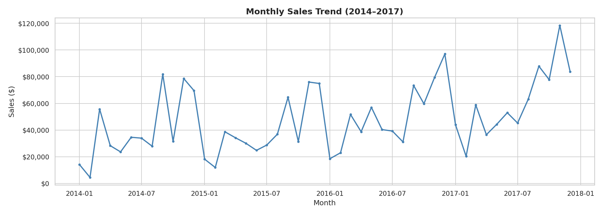
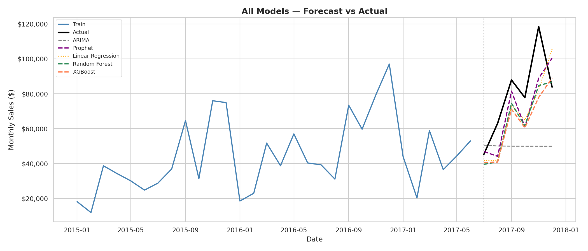
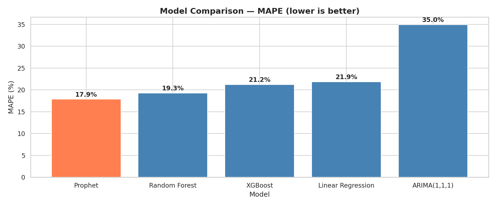

# Sales Forecasting — Superstore Dataset

End-to-end sales forecasting project using statistical and ML models on the 
Kaggle Superstore dataset (2014–2017).

## Project Overview
Forecast monthly sales using ARIMA, Facebook Prophet, XGBoost, Random Forest, 
and Linear Regression. Compare model performance and visualize findings on a 
Tableau Public dashboard.

## Dataset
- Source: [Kaggle Superstore Dataset](https://www.kaggle.com/datasets/vivek468/superstore-dataset-final)
- 9,994 rows | 4 years (2014–2017) | 3 categories | 4 regions

## Project Structure

sales-forecasting-superstore/
│
├── notebooks/
│   ├── sales_forecasting_eda.ipynb
│   ├── sales_forecasting_phase2.ipynb
│   └── sales_forecasting_models.ipynb
│
├── data/
│   ├── monthly_sales_features.csv
│   └── model_comparison_results.csv
│
├── visuals/
    ├── monthly_sales_trend.png
    ├── sales_by_category_region.png
    ├── profit_analysis.png
    ├── seasonality.png
    ├── time_series_decomposition.png
    ├── train_test_split.png
    ├── acf_pacf.png
    ├── arima_forecast.png
    ├── prophet_forecast.png
    ├── prophet_components.png
    ├── model_comparison_mape.png
    ├── all_models_forecast.png
    └── feature_importance.png

## Methodology
1. **EDA** — sales trends, category/region breakdown, seasonality analysis
2. **Feature Engineering** — lag features (1,2,3,12 months), rolling averages, 
   calendar features
3. **Time Series Models** — ARIMA(1,1,1), Facebook Prophet
4. **ML Models** — XGBoost, Random Forest, Linear Regression
5. **Evaluation** — MAE, RMSE, MAPE on 6-month holdout test set

## Model Results

| Model | MAE | RMSE | MAPE |
|---|---|---|---|
| **Prophet** | $14,973 | $17,478 | **17.86%** |
| Random Forest | $15,666 | $18,754 | 19.27% |
| XGBoost | $17,775 | $21,467 | 21.21% |
| Linear Regression | $18,380 | $20,925 | 21.87% |
| ARIMA(1,1,1) | $31,095 | $37,098 | 34.95% |

**Prophet achieved the lowest MAPE (17.86%)**, outperforming all ML models 
by effectively capturing yearly seasonality and upward trend in the data.

## Key Findings
- Total sales: $2,297,201 over 4 years with consistent upward trend
- Q4 consistently shows highest sales across all years (seasonality peak)
- Technology category generates highest revenue; Office Supplies highest volume
- West region leads in total sales; South has lowest contribution
- lag_12 (same month last year) is the most important ML feature

## Dashboard
🔗 [View Tableau Public Dashboard](https://public.tableau.com/app/profile/anshika.sharma3489/viz/SalesForecastingDashboard_17810876090850/Dashboard1)

## Visuals
### Monthly Sales Trend

### All Models — Forecast vs Actual

### Model Comparison — MAPE

### Feature Importance (XGBoost)

## Tools & Libraries
Python, Pandas, NumPy, Matplotlib, Seaborn, Statsmodels, Facebook Prophet, 
Scikit-learn, XGBoost, Tableau Public

## Author
Anshika Sharma  
[GitHub](https://github.com/anshisharma9472-ops) | 
[LinkedIn](linkedin.com/in/anshika-sharma9472)
